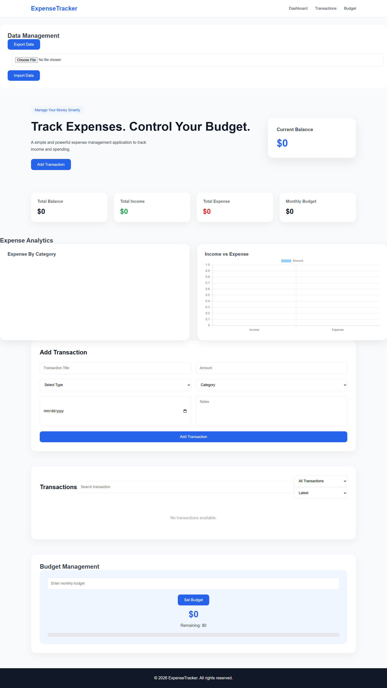

# 💰 Expense Tracker

A modern and responsive expense management web application built with HTML, CSS, and Vanilla JavaScript.

Users can manage income and expenses, track budgets, analyze spending, and store data locally in the browser.

## 📸 Preview

 

---

## 🚀 Features

### Transaction Management
- Add income and expenses
- Edit transactions
- Delete transactions
- Search transactions
- Filter by type
- Sort transactions

### Dashboard
- Total balance calculation
- Income tracking
- Expense tracking
- Monthly budget overview

### Budget Management
- Set monthly budget
- Track remaining budget
- Visual spending progress

### Analytics
- Expense category charts
- Income vs expense comparison
- Dynamic charts using Chart.js

### Data Management
- Export transactions as JSON
- Import backup data
- LocalStorage persistence

---

## 🛠️ Technologies Used

- HTML5
- CSS3
- JavaScript (ES6)
- LocalStorage
- Chart.js

---

## 📂 Project Structure

Expense Tracker
